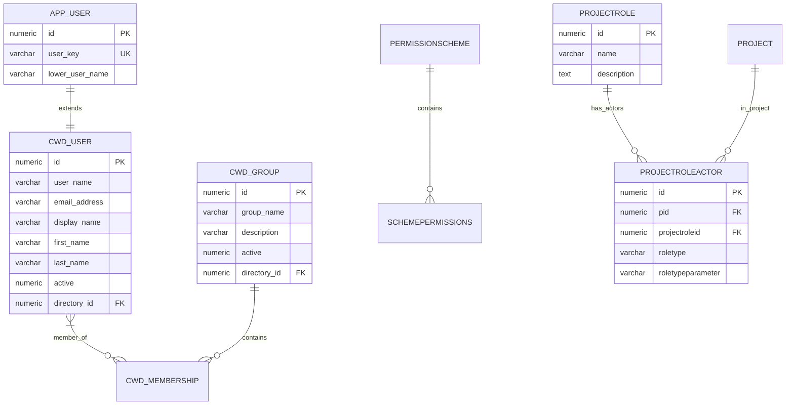
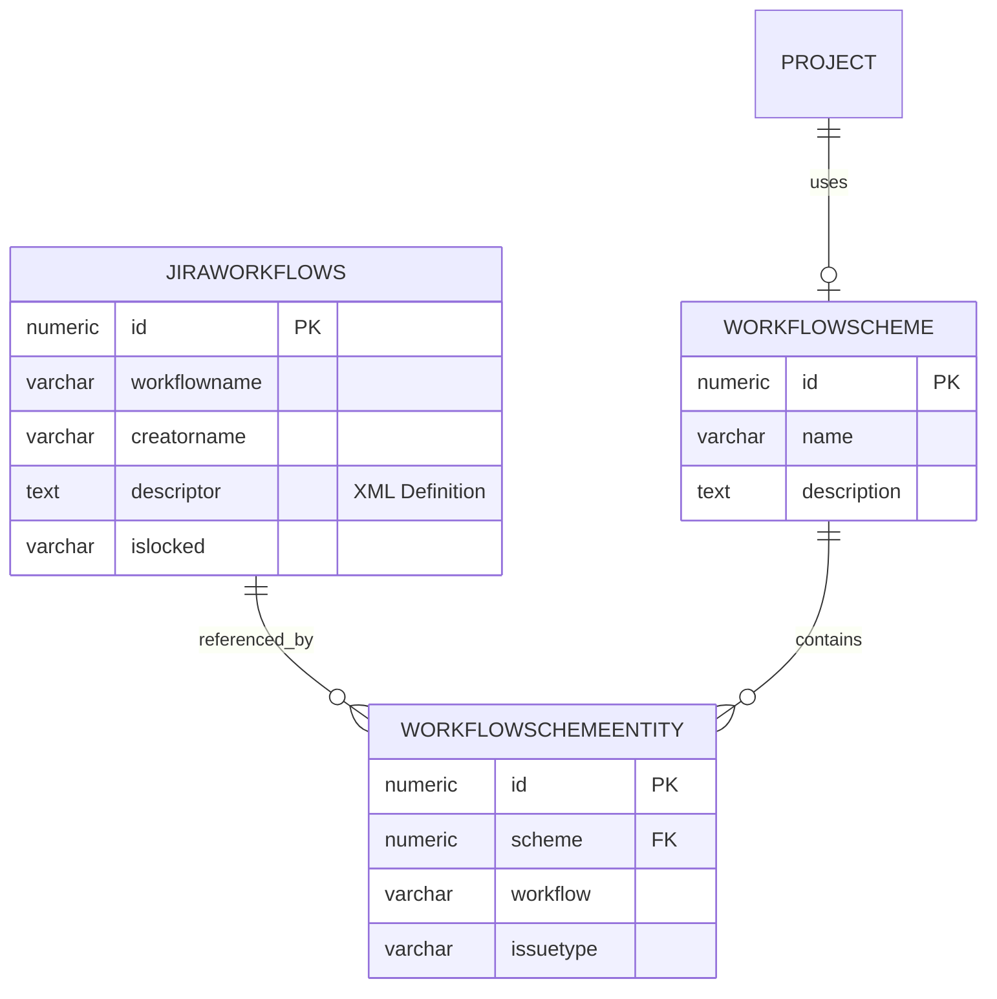
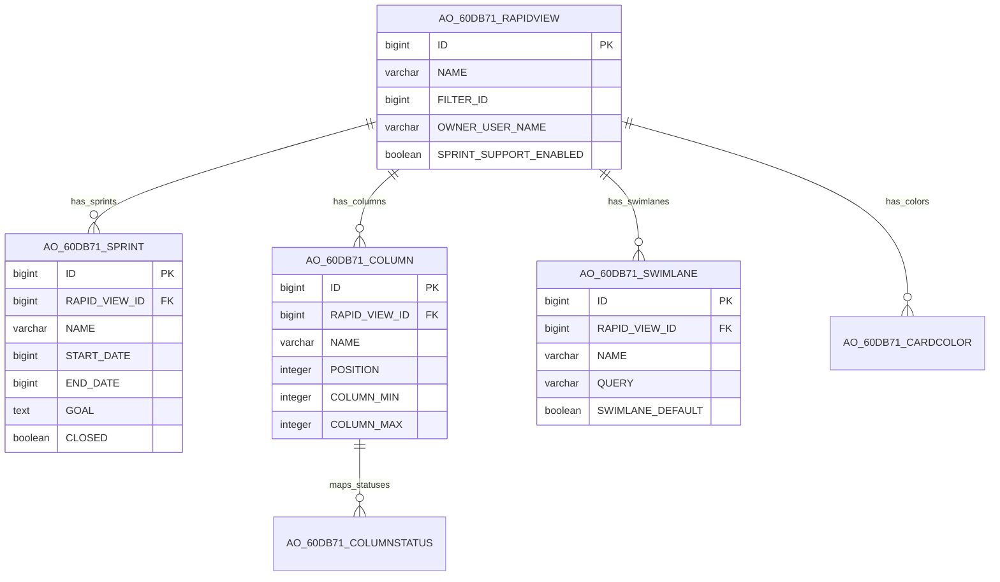
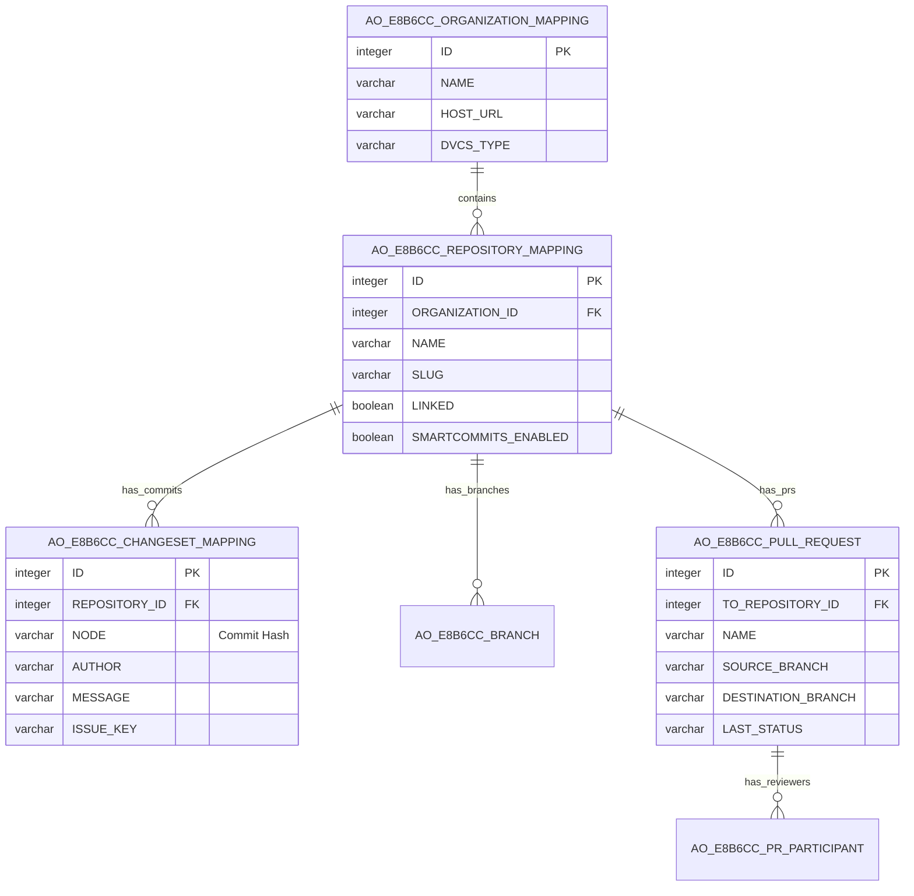

# Jira Data Center Database Architecture

## Technical Documentation & Complete Schema Analysis

---

## Table of Contents
1. [Executive Summary](#executive-summary)
2. [Database Statistics](#database-statistics)
3. [Schema Architecture Overview](#schema-architecture-overview)
4. [Core Domain Tables](#core-domain-tables)
5. [Plugin Tables (AO_* Prefix)](#plugin-tables-ao_-prefix)
6. [Entity Relationship Diagrams](#entity-relationship-diagrams)
7. [Index Analysis](#index-analysis)
8. [Foreign Key Relationships](#foreign-key-relationships)
9. [Views, Functions & Stored Procedures](#views-functions--stored-procedures)
10. [Migration Considerations](#migration-considerations)

---

## Executive Summary

This document provides a comprehensive technical analysis of the Jira Data Center PostgreSQL database schema (version 17.5). The schema represents a mature enterprise issue tracking system with approximately **400+ tables**, extensive plugin architecture, and robust workflow management.

### Key Findings
- **Database Engine**: PostgreSQL 17.5
- **Total Tables**: ~400 (200 core + 200 plugin)
- **Plugin Tables**: Prefixed with `AO_XXXXXX_` (Active Objects)
- **Core Schema**: `public` schema only
- **Primary Key Pattern**: Mix of `numeric(18,0)` and `VARCHAR` IDs
- **No Stored Procedures or Custom Functions**: Schema is table-only (no PL/pgSQL functions detected)
- **No Database Views**: Pure table-based architecture
- **Extensive Indexing**: Hundreds of indexes for performance optimization

---

## Database Statistics

| Category | Count |
|----------|-------|
| Core Tables | ~200 |
| Plugin Tables (AO_*) | ~200 |
| Sequences | ~200 |
| Indexes | ~500+ |
| Primary Key Constraints | ~400 |
| Unique Constraints | ~100 |
| Foreign Key Constraints | 0 (enforced at application level) |
| Database Functions | 0 |
| Database Views | 0 |
| Triggers | 0 |

---

## Schema Architecture Overview

The Jira database follows a **modular architecture** with two distinct layers:

### 1. Core Tables (No Prefix)
These are the foundational tables managed by Jira Core:
- Project management
- Issue tracking
- User management
- Workflow engine
- Permissions system

### 2. Plugin Tables (AO_* Prefix)
Active Objects tables created by plugins and add-ons:
- Each plugin has a unique hex identifier (e.g., `AO_60DB71_*`)
- Tables are self-contained within their plugin namespace
- Common plugin families identified:
  - `AO_60DB71_*` - Jira Software (Agile boards, sprints)
  - `AO_589059_*` - Automation for Jira
  - `AO_E8B6CC_*` - DVCS/Git Integration
  - `AO_D9132D_*` - Portfolio/Advanced Roadmaps
  - `AO_A415DF_*` - Portfolio Plans
  - `AO_FE1BC5_*` - OAuth2 Authentication
  - `AO_4AEACD_*` - Webhooks

---

## Core Domain Tables

### 1. Projects & Issues

#### PROJECT
Central project container.

```sql
CREATE TABLE public.project (
    id numeric(18,0) NOT NULL PRIMARY KEY,
    pname character varying(255),           -- Project name
    url character varying(255),             -- Project URL
    lead character varying(255),            -- Project lead user key
    description text,                        -- Project description
    pkey character varying(255),            -- Project key (e.g., "PROJ")
    pcounter numeric(18,0),                 -- Issue counter
    assigneetype numeric(18,0),             -- Default assignee type
    avatar numeric(18,0),                   -- Avatar ID
    originalkey character varying(255),     -- Original key if renamed
    projecttype character varying(255),     -- software, business, etc.
    projecttypestyle character varying(255),
    archived character(1)                   -- 'Y' if archived
);
```

#### JIRAISSUE
The core issue/ticket entity.

```sql
CREATE TABLE public.jiraissue (
    id numeric(18,0) NOT NULL PRIMARY KEY,
    pkey character varying(255),            -- Issue key (e.g., "PROJ-123")
    issuenum numeric(18,0),                 -- Issue number within project
    project numeric(18,0),                  -- FK to project.id
    reporter character varying(255),        -- Reporter user key
    assignee character varying(255),        -- Assignee user key
    creator character varying(255),         -- Creator user key
    issuetype character varying(255),       -- FK to issuetype.id
    summary character varying(255),         -- Issue title
    description text,                       -- Full description
    environment text,                       -- Environment details
    priority character varying(255),        -- FK to priority.id
    resolution character varying(255),      -- FK to resolution.id
    issuestatus character varying(255),     -- FK to issuestatus.id
    created timestamp with time zone,       -- Creation timestamp
    updated timestamp with time zone,       -- Last update timestamp
    duedate timestamp with time zone,       -- Due date
    resolutiondate timestamp with time zone,-- Resolution timestamp
    votes numeric(18,0),                    -- Vote count
    watches numeric(18,0),                  -- Watcher count
    timeoriginalestimate numeric(18,0),     -- Original estimate (seconds)
    timeestimate numeric(18,0),             -- Remaining estimate
    timespent numeric(18,0),                -- Time logged
    workflow_id numeric(18,0),              -- Current workflow instance
    security numeric(18,0),                 -- Security level ID
    fixfor numeric(18,0),                   -- Fix version ID
    component numeric(18,0),                -- Component ID
    archived character(1),                  -- 'Y' if archived
    archivedby character varying(255),      -- User who archived
    archiveddate timestamp with time zone   -- Archive timestamp
);
```

#### ISSUETYPE
Defines types of issues (Bug, Story, Task, etc.).

```sql
CREATE TABLE public.issuetype (
    id character varying(60) NOT NULL PRIMARY KEY,
    sequence numeric(18,0),         -- Display order
    pname character varying(60),    -- Type name
    pstyle character varying(60),   -- Style identifier
    description text,               -- Description
    iconurl character varying(255), -- Icon URL
    avatar numeric(18,0)            -- Avatar ID
);
```

#### ISSUESTATUS
Issue status definitions.

```sql
CREATE TABLE public.issuestatus (
    id character varying(60) NOT NULL PRIMARY KEY,
    sequence numeric(18,0),         -- Display order
    pname character varying(60),    -- Status name
    description text,               -- Description
    iconurl character varying(255), -- Icon URL
    statuscategory numeric(18,0)    -- Category (To Do, In Progress, Done)
);
```

#### PRIORITY
Issue priority levels.

```sql
CREATE TABLE public.priority (
    id character varying(60) NOT NULL PRIMARY KEY,
    sequence numeric(18,0),
    pname character varying(60),
    description text,
    iconurl character varying(255),
    status_color character varying(60)
);
```

#### RESOLUTION
Issue resolution types.

```sql
CREATE TABLE public.resolution (
    id character varying(60) NOT NULL PRIMARY KEY,
    sequence numeric(18,0),
    pname character varying(60),
    description text,
    iconurl character varying(255)
);
```

### 2. User Management

#### APP_USER
Core user identity.

```sql
CREATE TABLE public.app_user (
    id numeric(18,0) NOT NULL PRIMARY KEY,
    user_key character varying(255),    -- Unique user key
    lower_user_name character varying(255) -- Lowercase username for lookups
);
```

#### CWD_USER
Crowd directory user details.

```sql
CREATE TABLE public.cwd_user (
    id numeric(18,0) NOT NULL PRIMARY KEY,
    directory_id numeric(18,0),
    user_name character varying(255),
    lower_user_name character varying(255),
    active numeric(9,0),
    created_date timestamp with time zone,
    updated_date timestamp with time zone,
    first_name character varying(255),
    lower_first_name character varying(255),
    last_name character varying(255),
    lower_last_name character varying(255),
    display_name character varying(255),
    lower_display_name character varying(255),
    email_address character varying(255),
    lower_email_address character varying(255),
    external_id character varying(255),
    credential character varying(255)
);
```

#### CWD_GROUP
User groups.

```sql
CREATE TABLE public.cwd_group (
    id numeric(18,0) NOT NULL PRIMARY KEY,
    group_name character varying(255),
    lower_group_name character varying(255),
    active numeric(9,0),
    local numeric(9,0),
    created_date timestamp with time zone,
    updated_date timestamp with time zone,
    description character varying(255),
    group_type character varying(60),
    directory_id numeric(18,0)
);
```

#### CWD_MEMBERSHIP
User-group associations.

```sql
CREATE TABLE public.cwd_membership (
    id numeric(18,0) NOT NULL PRIMARY KEY,
    parent_id numeric(18,0),       -- Group ID
    child_id numeric(18,0),        -- User ID
    membership_type character varying(60),
    group_type character varying(60),
    parent_name character varying(255),
    lower_parent_name character varying(255),
    child_name character varying(255),
    lower_child_name character varying(255),
    directory_id numeric(18,0)
);
```

### 3. Workflow System

#### JIRAWORKFLOWS
Workflow definitions stored as XML.

```sql
CREATE TABLE public.jiraworkflows (
    id numeric(18,0) NOT NULL PRIMARY KEY,
    workflowname character varying(255),   -- Workflow name
    creatorname character varying(255),    -- Creator user
    descriptor text,                        -- XML workflow definition
    islocked character varying(60)         -- Lock status
);
```

#### WORKFLOWSCHEME
Associates workflows with projects.

```sql
CREATE TABLE public.workflowscheme (
    id numeric(18,0) NOT NULL PRIMARY KEY,
    name character varying(255),
    description text
);
```

#### WORKFLOWSCHEMEENTITY
Maps issue types to workflows within a scheme.

```sql
CREATE TABLE public.workflowschemeentity (
    id numeric(18,0) NOT NULL PRIMARY KEY,
    scheme numeric(18,0),           -- FK to workflowscheme.id
    workflow character varying(255), -- Workflow name
    issuetype character varying(255) -- Issue type ID or null for default
);
```

### 4. Permissions System

#### SCHEMEPERMISSIONS
Permission entries within permission schemes.

```sql
CREATE TABLE public.schemepermissions (
    id numeric(18,0) NOT NULL PRIMARY KEY,
    scheme numeric(18,0),           -- Scheme ID
    permission numeric(18,0),       -- Permission type
    perm_type character varying(255),
    perm_parameter character varying(255)
);
```

#### PERMISSIONSCHEME
Permission scheme definitions.

```sql
CREATE TABLE public.permissionscheme (
    id numeric(18,0) NOT NULL PRIMARY KEY,
    name character varying(255),
    description text
);
```

#### PROJECTROLE
Project role definitions.

```sql
CREATE TABLE public.projectrole (
    id numeric(18,0) NOT NULL PRIMARY KEY,
    name character varying(255),
    description text
);
```

#### PROJECTROLEACTOR
Associates users/groups with project roles.

```sql
CREATE TABLE public.projectroleactor (
    id numeric(18,0) NOT NULL PRIMARY KEY,
    pid numeric(18,0),              -- Project ID
    projectroleid numeric(18,0),    -- Role ID
    roletype character varying(255),
    roletypeparameter character varying(255)
);
```

### 5. Comments & History

#### JIRAACTION
Issue comments and actions.

```sql
CREATE TABLE public.jiraaction (
    id numeric(18,0) NOT NULL PRIMARY KEY,
    issueid numeric(18,0),          -- FK to jiraissue.id
    author character varying(255),   -- Comment author
    actiontype character varying(255), -- Type of action
    actionlevel character varying(255),
    rolelevel numeric(18,0),
    actionbody text,                 -- Comment body
    created timestamp with time zone,
    updateauthor character varying(255),
    updated timestamp with time zone,
    actionnum numeric(18,0)
);
```

#### CHANGEGROUP
Groups of changes made in a single update.

```sql
CREATE TABLE public.changegroup (
    id numeric(18,0) NOT NULL PRIMARY KEY,
    issueid numeric(18,0),          -- FK to jiraissue.id
    author character varying(255),
    created timestamp with time zone
);
```

#### CHANGEITEM
Individual field changes within a change group.

```sql
CREATE TABLE public.changeitem (
    id numeric(18,0) NOT NULL PRIMARY KEY,
    groupid numeric(18,0),          -- FK to changegroup.id
    fieldtype character varying(255),
    field character varying(255),    -- Field name
    oldvalue text,                   -- Previous value
    oldstring text,                  -- Previous display value
    newvalue text,                   -- New value
    newstring text                   -- New display value
);
```

### 6. Components & Versions

#### COMPONENT
Project components.

```sql
CREATE TABLE public.component (
    id numeric(18,0) NOT NULL PRIMARY KEY,
    project numeric(18,0),          -- FK to project.id
    cname character varying(255),   -- Component name
    description text,
    url character varying(255),
    lead character varying(255),
    assigneetype numeric(18,0),
    ArchiveDate timestamp with time zone
);
```

#### PROJECTVERSION
Version/release definitions.

```sql
CREATE TABLE public.projectversion (
    id numeric(18,0) NOT NULL PRIMARY KEY,
    project numeric(18,0),          -- FK to project.id
    vname character varying(255),   -- Version name
    description text,
    sequence numeric(18,0),
    released character varying(10),
    archived character varying(10),
    url character varying(255),
    startdate timestamp with time zone,
    releasedate timestamp with time zone
);
```

### 7. Custom Fields

#### CUSTOMFIELD
Custom field definitions.

```sql
CREATE TABLE public.customfield (
    id numeric(18,0) NOT NULL PRIMARY KEY,
    customfieldtypekey character varying(255), -- Field type
    customfieldsearcherkey character varying(255),
    cfname character varying(255),  -- Field name
    description text,
    defaultvalue character varying(255),
    fieldtype numeric(18,0),
    project numeric(18,0),
    issuetype character varying(255)
);
```

#### CUSTOMFIELDVALUE
Custom field values for issues.

```sql
CREATE TABLE public.customfieldvalue (
    id numeric(18,0) NOT NULL PRIMARY KEY,
    issue numeric(18,0),            -- FK to jiraissue.id
    customfield numeric(18,0),      -- FK to customfield.id
    parentkey character varying(255),
    stringvalue character varying(255),
    numbervalue double precision,
    textvalue text,
    datevalue timestamp with time zone,
    valuetype character varying(255)
);
```

#### CUSTOMFIELDOPTION
Option values for select-type custom fields.

```sql
CREATE TABLE public.customfieldoption (
    id numeric(18,0) NOT NULL PRIMARY KEY,
    customfield numeric(18,0),      -- FK to customfield.id
    customfieldconfig numeric(18,0),
    parentoptionid numeric(18,0),
    sequence numeric(18,0),
    customvalue character varying(255),
    optiontype character varying(60),
    disabled character varying(60)
);
```

### 8. Attachments & Files

#### FILEATTACHMENT
File attachments on issues.

```sql
CREATE TABLE public.fileattachment (
    id numeric(18,0) NOT NULL PRIMARY KEY,
    issueid numeric(18,0),          -- FK to jiraissue.id
    mimetype character varying(255),
    filename character varying(255),
    created timestamp with time zone,
    filesize numeric(18,0),
    author character varying(255),
    zip numeric(9,0),
    thumbnailable numeric(9,0)
);
```

### 9. Issue Linking

#### ISSUELINK
Links between issues.

```sql
CREATE TABLE public.issuelink (
    id numeric(18,0) NOT NULL PRIMARY KEY,
    linktype numeric(18,0),         -- FK to issuelinktype.id
    source numeric(18,0),           -- Source issue ID
    destination numeric(18,0),       -- Destination issue ID
    sequence numeric(18,0)
);
```

#### ISSUELINKTYPE
Link type definitions.

```sql
CREATE TABLE public.issuelinktype (
    id numeric(18,0) NOT NULL PRIMARY KEY,
    linkname character varying(255), -- Link name
    inward character varying(255),   -- Inward description
    outward character varying(255),  -- Outward description
    pstyle character varying(60),
    "position" numeric(18,0)
);
```

### 10. Time Tracking

#### WORKLOG
Work logged on issues.

```sql
CREATE TABLE public.worklog (
    id numeric(18,0) NOT NULL PRIMARY KEY,
    issueid numeric(18,0),          -- FK to jiraissue.id
    author character varying(255),
    grouplevel character varying(255),
    rolelevel numeric(18,0),
    worklogbody text,               -- Work description
    created timestamp with time zone,
    updateauthor character varying(255),
    updated timestamp with time zone,
    startdate timestamp with time zone,
    timeworked numeric(18,0)         -- Time in seconds
);
```

---

## Plugin Tables (AO_* Prefix)

### Jira Software / Agile (AO_60DB71_*)

#### AO_60DB71_SPRINT
Sprint definitions for Scrum boards.

```sql
CREATE TABLE public."AO_60DB71_SPRINT" (
    "ID" bigint NOT NULL PRIMARY KEY,
    "COMPLETE_DATE" bigint,         -- Completion timestamp
    "END_DATE" bigint,              -- End date timestamp
    "GOAL" text,                     -- Sprint goal
    "NAME" character varying(255),   -- Sprint name
    "RAPID_VIEW_ID" bigint,         -- Board ID
    "SEQUENCE" bigint,              -- Display order
    "START_DATE" bigint,            -- Start date timestamp
    "STARTED" boolean,              -- Has started flag
    "CLOSED" boolean,               -- Is closed flag
    "ISSUE_RANK_DIRTY" boolean      -- Needs re-ranking
);
```

#### AO_60DB71_RAPIDVIEW
Agile board configurations.

```sql
CREATE TABLE public."AO_60DB71_RAPIDVIEW" (
    "ID" bigint NOT NULL PRIMARY KEY,
    "ADMIN_CUSTOM_FIELD_ID" bigint,
    "CARD_COLOR_STRATEGY" character varying(255),
    "FILTER_ID" bigint,             -- Saved filter ID
    "NAME" character varying(255),   -- Board name
    "OWNER_USER_NAME" character varying(255),
    "PROJECT_KEY" character varying(255),
    "RANKING_FIELD_ID" character varying(255),
    "SAVED_FILTER_ID" bigint,
    "SPRINT_SUPPORT_ENABLED" boolean,
    "SWIMLANE_STRATEGY" character varying(255)
);
```

#### AO_60DB71_COLUMN
Board columns (workflow mapping).

```sql
CREATE TABLE public."AO_60DB71_COLUMN" (
    "ID" bigint NOT NULL PRIMARY KEY,
    "COLUMN_MAX" integer,            -- WIP limit max
    "COLUMN_MIN" integer,            -- WIP limit min
    "NAME" character varying(255),   -- Column name
    "POSITION" integer,              -- Display order
    "RAPID_VIEW_ID" bigint          -- FK to board
);
```

#### AO_60DB71_SWIMLANE
Swimlane configurations.

```sql
CREATE TABLE public."AO_60DB71_SWIMLANE" (
    "DESCRIPTION" character varying(255),
    "ID" bigint NOT NULL PRIMARY KEY,
    "NAME" character varying(255),
    "POSITION" integer,
    "QUERY" character varying(255),  -- JQL query
    "RAPID_VIEW_ID" bigint,
    "SWIMLANE_DEFAULT" boolean       -- Is default swimlane
);
```

#### AO_60DB71_LEXORANK
Issue ranking (LexoRank algorithm).

```sql
CREATE TABLE public."AO_60DB71_LEXORANK" (
    "ID" bigint NOT NULL PRIMARY KEY,
    "BUCKET" integer,
    "FIELD_ID" bigint,
    "ISSUE_ID" bigint,              -- Issue ID
    "LOCK_HASH" character varying(255),
    "LOCK_TIME" bigint,
    "RANK" character varying(255),   -- LexoRank value
    "TYPE" integer
);
```

### Automation for Jira (AO_589059_*)

#### AO_589059_RULE_CONFIG
Automation rule definitions.

```sql
CREATE TABLE public."AO_589059_RULE_CONFIG" (
    "AUTHOR_KEY" character varying(255),
    "CLIENT_KEY" character varying(255),
    "CREATED" timestamp without time zone,
    "DESCRIPTION" text,
    "ID" bigint NOT NULL PRIMARY KEY,
    "IS_TEMPLATE" boolean,
    "MIGRATED_ID" bigint,
    "NAME" character varying(255),   -- Rule name
    "STATE" character varying(255),  -- ENABLED, DISABLED
    "TAGS" text,
    "TRIGGER_COMPONENT_ID" bigint,
    "UPDATED" timestamp without time zone
);
```

#### AO_589059_RULE_CFG_COMPONENT
Rule components (triggers, conditions, actions).

```sql
CREATE TABLE public."AO_589059_RULE_CFG_COMPONENT" (
    "COMPONENT" character varying(255), -- Component type
    "CONDITION_PARENT_ID" bigint,
    "ID" bigint NOT NULL PRIMARY KEY,
    "PARENT_CFG_COMPONENT_ID" bigint,
    "RULE_CONFIG_ID" bigint,        -- FK to rule
    "SCHEMA_VERSION" integer,
    "SEQUENCE" integer,
    "TYPE" character varying(255),   -- TRIGGER, CONDITION, ACTION
    "VALUE" text                     -- JSON configuration
);
```

#### AO_589059_AUDIT_ITEM
Automation execution audit log.

```sql
CREATE TABLE public."AO_589059_AUDIT_ITEM" (
    "AUTHOR_KEY" character varying(255),
    "CATEGORY" character varying(255),
    "CLIENT_KEY" character varying(255),
    "CREATED" timestamp without time zone,
    "DESCRIPTION" text,
    "DURATION" bigint,
    "END_TIME" timestamp without time zone,
    "END_TO_END_DURATION" bigint,
    "EVENT_SOURCE" character varying(255),
    "ID" bigint NOT NULL PRIMARY KEY,
    "OBJECT_ITEM_ID" bigint,
    "OBJECT_ITEM_NAME" character varying(255),
    "OBJECT_ITEM_PARENT_ID" character varying(255),
    "OBJECT_ITEM_PARENT_NAME" character varying(255),
    "OBJECT_ITEM_TYPE" character varying(255),
    "START_TIME" timestamp without time zone,
    "SUMMARY" character varying(255)
);
```

### DVCS/Git Integration (AO_E8B6CC_*)

#### AO_E8B6CC_REPOSITORY_MAPPING
Connected Git repositories.

```sql
CREATE TABLE public."AO_E8B6CC_REPOSITORY_MAPPING" (
    "ACTIVITY_LAST_SYNC" timestamp without time zone,
    "DELETED" boolean,
    "FORK" boolean,
    "FORK_OF_NAME" character varying(255),
    "FORK_OF_OWNER" character varying(255),
    "FORK_OF_SLUG" character varying(255),
    "ID" integer NOT NULL PRIMARY KEY,
    "LAST_CHANGESET_NODE" character varying(255),
    "LAST_COMMIT_DATE" timestamp without time zone,
    "LINKED" boolean,
    "LOGO" text,
    "NAME" character varying(255),
    "ORGANIZATION_ID" integer,
    "SLUG" character varying(255),
    "SMARTCOMMITS_ENABLED" boolean,
    "UPDATE_LINK_AUTHORISED" boolean
);
```

#### AO_E8B6CC_CHANGESET_MAPPING
Git commits linked to Jira issues.

```sql
CREATE TABLE public."AO_E8B6CC_CHANGESET_MAPPING" (
    "AUTHOR" character varying(255),
    "AUTHOR_EMAIL" character varying(255),
    "BRANCH" character varying(255),
    "DATE" timestamp without time zone,
    "FILE_COUNT" integer,
    "FILE_DETAILS_JSON" text,
    "FILES_DATA" text,
    "ID" integer NOT NULL PRIMARY KEY,
    "ISSUE_KEY" character varying(255),
    "MESSAGE" text,
    "NODE" character varying(255),   -- Commit hash
    "PARENTS_DATA" character varying(255),
    "PROJECT_KEY" character varying(255),
    "RAW_AUTHOR" character varying(255),
    "RAW_NODE" character varying(255),
    "REPOSITORY_ID" integer,
    "SMARTCOMMIT_AVAILABLE" boolean,
    "VERSION" integer
);
```

#### AO_E8B6CC_PULL_REQUEST
Pull request information.

```sql
CREATE TABLE public."AO_E8B6CC_PULL_REQUEST" (
    "AUTHOR" character varying(255),
    "COMMENT_COUNT" integer,
    "CREATED_ON" timestamp without time zone,
    "DESTINATION_BRANCH" character varying(255),
    "DOMAIN_ID" integer,
    "EXECUTED_BY" character varying(255),
    "ID" integer NOT NULL PRIMARY KEY,
    "LAST_STATUS" character varying(255),
    "NAME" character varying(255),
    "REMOTE_ID" bigint,
    "SOURCE_BRANCH" character varying(255),
    "SOURCE_REPO" character varying(255),
    "TO_REPOSITORY_ID" integer,
    "UPDATED_ON" timestamp without time zone,
    "URL" character varying(255)
);
```

### Webhooks (AO_4AEACD_*)

#### AO_4AEACD_WEBHOOK_DAO
Webhook configurations.

```sql
CREATE TABLE public."AO_4AEACD_WEBHOOK_DAO" (
    "ENABLED" boolean,
    "ENCODED_EVENTS" character varying(255),
    "EXCLUDE_BODY" boolean,
    "FILTER" text,
    "ID" integer NOT NULL PRIMARY KEY,
    "JQL" text,
    "LAST_UPDATED" timestamp without time zone,
    "LAST_UPDATED_USER" character varying(255),
    "NAME" character varying(255),
    "REGISTRATION_METHOD" character varying(255),
    "URL" text
);
```

### Personal Access Tokens (AO_81F455_*)

#### AO_81F455_PERSONAL_TOKEN
Personal access token storage.

```sql
CREATE TABLE public."AO_81F455_PERSONAL_TOKEN" (
    "CREATED_AT" timestamp without time zone,
    "EXPIRING_AT" timestamp without time zone,
    "HASHED_TOKEN" character varying(255),
    "ID" bigint NOT NULL PRIMARY KEY,
    "LAST_ACCESSED_AT" timestamp without time zone,
    "NAME" character varying(255),
    "NOTIFICATION_STATE" character varying(255),
    "TOKEN_ID" character varying(255),
    "USER_KEY" character varying(255)
);
```

### Advanced Roadmaps / Portfolio (AO_D9132D_* and AO_A415DF_*)

#### AO_D9132D_PLAN
Portfolio plan definitions.

```sql
CREATE TABLE public."AO_D9132D_PLAN" (
    "AUTO_SCHEDULE" boolean,
    "DEFAULT_SPRINT_CAPACITY" bigint,
    "DESCRIPTION" text,
    "ESTIMATE_ERROR_THRESHOLD" integer,
    "ESTIMATION_UNIT_TYPE" character varying(255),
    "ID" bigint NOT NULL PRIMARY KEY,
    "IS_BACKLOG_SHARED" boolean,
    "ISSUE_SOURCE_TYPE" character varying(255),
    "NAME" character varying(255),
    "OWNER" character varying(255),
    "PROGRAM_ID" bigint,
    "STORY_POINT_FIELD_KEY" character varying(255)
);
```

---

## Entity Relationship Diagrams

### Core Issue Management ER Diagram


### User & Permissions ER Diagram



### Workflow System ER Diagram



### Agile / Jira Software ER Diagram



### Git/DVCS Integration ER Diagram



---

## Index Analysis

### Critical Performance Indexes

The schema includes hundreds of indexes optimized for common query patterns:

#### Issue Queries
```sql
CREATE INDEX action_issue ON public.jiraaction (issueid);
CREATE INDEX action_author_created ON public.jiraaction (author, created);
CREATE INDEX attach_issue ON public.fileattachment (issueid);
CREATE INDEX chgitem_chggrp ON public.changeitem (groupid);
CREATE INDEX chggroup_issue ON public.changegroup (issueid);
CREATE INDEX cfvalue_issue ON public.customfieldvalue (issue, customfield);
CREATE INDEX issuelink_src ON public.issuelink (source);
CREATE INDEX issuelink_dest ON public.issuelink (destination);
```

#### Project Queries
```sql
CREATE INDEX issue_proj_status ON public.jiraissue (project, issuestatus);
CREATE INDEX issue_proj_num ON public.jiraissue (project, issuenum);
CREATE INDEX idx_project_key ON public.project (pkey);
```

#### User Queries
```sql
CREATE INDEX uk_user_name_dir_id ON public.cwd_user (lower_user_name, directory_id);
CREATE INDEX uk_user_externalid_dir_id ON public.cwd_user (external_id, directory_id);
CREATE INDEX idx_email_address ON public.cwd_user (lower_email_address);
```

#### Agile/Sprint Queries
```sql
CREATE INDEX index_ao_60db71_spr1794552746 ON "AO_60DB71_SPRINT" ("RAPID_VIEW_ID");
CREATE INDEX index_ao_60db71_lex604083109 ON "AO_60DB71_LEXORANK" ("ISSUE_ID");
CREATE INDEX index_ao_60db71_lex1694305086 ON "AO_60DB71_LEXORANK" ("FIELD_ID", "BUCKET", "RANK");
```

---

## Foreign Key Relationships

**Important Note**: This schema does NOT use database-level foreign key constraints. All referential integrity is enforced at the **application level**. This is a deliberate design choice by Atlassian for:

1. **Performance**: Avoids FK check overhead on inserts/updates
2. **Flexibility**: Allows orphaned records during migrations
3. **Plugin Architecture**: AO_ tables can reference core tables without strict coupling

### Logical Relationships (Application-Enforced)

| Parent Table | Child Table | Relationship |
|--------------|-------------|--------------|
| project | jiraissue | project.id → jiraissue.project |
| jiraissue | jiraaction | jiraissue.id → jiraaction.issueid |
| jiraissue | changegroup | jiraissue.id → changegroup.issueid |
| jiraissue | fileattachment | jiraissue.id → fileattachment.issueid |
| jiraissue | worklog | jiraissue.id → worklog.issueid |
| jiraissue | customfieldvalue | jiraissue.id → customfieldvalue.issue |
| changegroup | changeitem | changegroup.id → changeitem.groupid |
| customfield | customfieldvalue | customfield.id → customfieldvalue.customfield |
| customfield | customfieldoption | customfield.id → customfieldoption.customfield |
| app_user | * | app_user.user_key → *.author/reporter/assignee |
| AO_60DB71_RAPIDVIEW | AO_60DB71_SPRINT | RAPIDVIEW.ID → SPRINT.RAPID_VIEW_ID |

---

## Views, Functions & Stored Procedures

### Analysis Result: None Detected

The schema dump analysis reveals:
- **Database Views**: 0
- **Stored Procedures**: 0
- **User-Defined Functions**: 0
- **Triggers**: 0

Jira Data Center operates as a **pure table-based schema** with all business logic implemented in the Java application layer. This design choice:

1. Keeps the database portable across PostgreSQL, MySQL, Oracle, and SQL Server
2. Centralizes business logic in the application for easier maintenance
3. Allows clustering without complex database replication of procedures

---

## Migration Considerations

### Direct Migration Compatibility ✅

| Source Table | Migration Status | Notes |
|--------------|------------------|-------|
| project | ✅ Direct | Core project data |
| jiraissue | ✅ Direct | Issue records |
| app_user | ✅ Direct | User identities |
| cwd_user | ✅ Direct | User details |
| jiraaction | ✅ Direct | Comments |
| changegroup + changeitem | ✅ Direct | History |
| fileattachment | ✅ Direct | Metadata only (files stored on disk) |
| worklog | ✅ Direct | Time tracking |
| component | ✅ Direct | Components |
| projectversion | ✅ Direct | Versions |
| customfield + customfieldvalue | ✅ Direct | Custom fields |
| issuelink + issuelinktype | ✅ Direct | Links |

### Requires Transformation ⚠️

| Source Table | Migration Status | Notes |
|--------------|------------------|-------|
| jiraworkflows | ⚠️ Parse XML | Workflow definitions stored as XML |
| AO_60DB71_RAPIDVIEW | ⚠️ Mapping | Board configurations |
| AO_60DB71_SPRINT | ⚠️ Mapping | Sprint data |
| AO_589059_RULE_CONFIG | ⚠️ Mapping | Automation rules |
| schemepermissions | ⚠️ Mapping | Permission configurations |

### Plugin-Specific (May Skip) ⏭️

| Prefix | Plugin | Action |
|--------|--------|--------|
| AO_E8B6CC_* | DVCS Connector | Re-connect in new system |
| AO_4AEACD_* | Webhooks | Recreate configurations |
| AO_81F455_* | Personal Tokens | Regenerate tokens |
| AO_ED669C_* | SSO/SAML | Reconfigure |

### ID Strategy Recommendations

1. **Preserve Original IDs**: Maintain `jiraissue.id`, `project.id` as-is
2. **Map User Keys**: `app_user.user_key` is the canonical user identifier
3. **Issue Key Format**: Preserve `PROJECT-123` format
4. **Timestamps**: Maintain original `created`/`updated` timestamps

### Data Volumes to Expect

Based on typical Jira installations:
- **Issues**: Can range from 10K to 10M+
- **Comments**: ~3-5x issue count
- **Change Items**: ~10-20x issue count
- **Custom Field Values**: ~5-10x issue count
- **Attachments**: Varies widely

---

## Summary

This Jira Data Center schema represents a mature, enterprise-grade issue tracking database with:

- **~400 tables** split between core and plugin namespaces
- **Pure table architecture** with no stored procedures or views
- **Application-level referential integrity** (no FK constraints)
- **Extensive indexing** for performance optimization
- **Modular plugin system** via Active Objects (AO_* tables)
- **XML-based workflow storage** requiring parsing for migration

The schema is designed for horizontal scalability and cross-database portability, making it suitable for our application migration with proper field mapping and data transformation.
